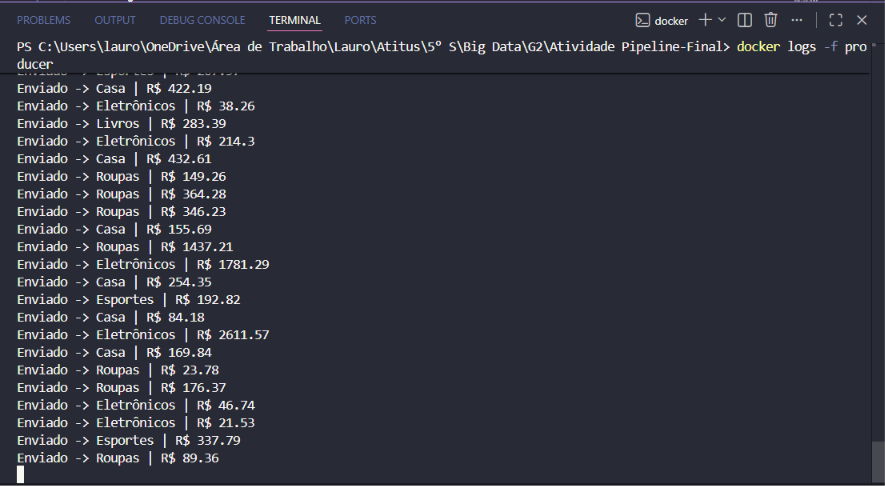
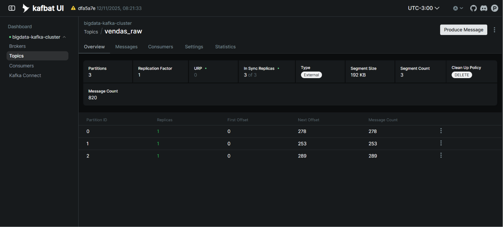
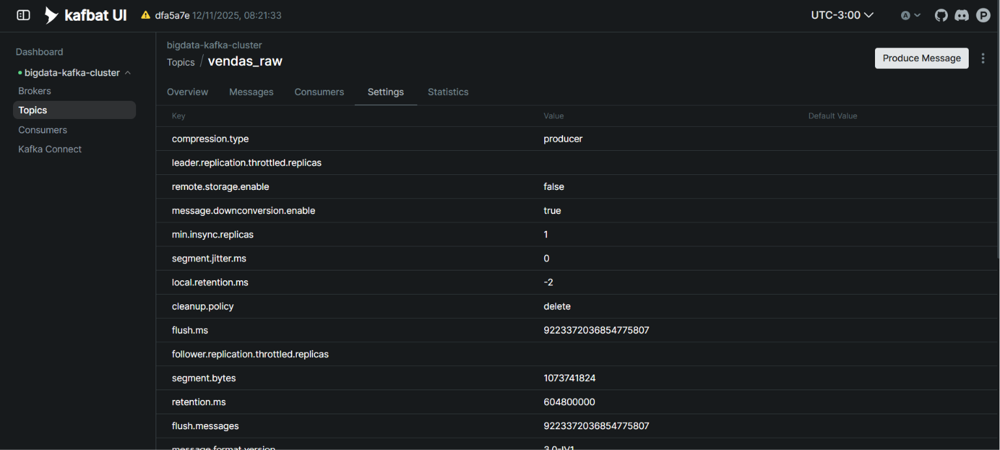
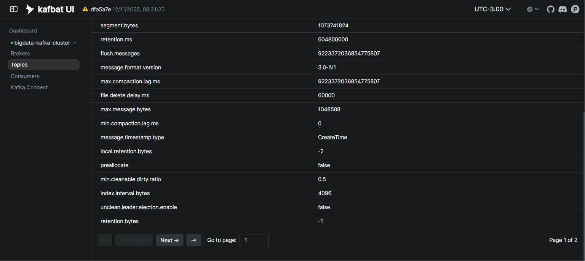
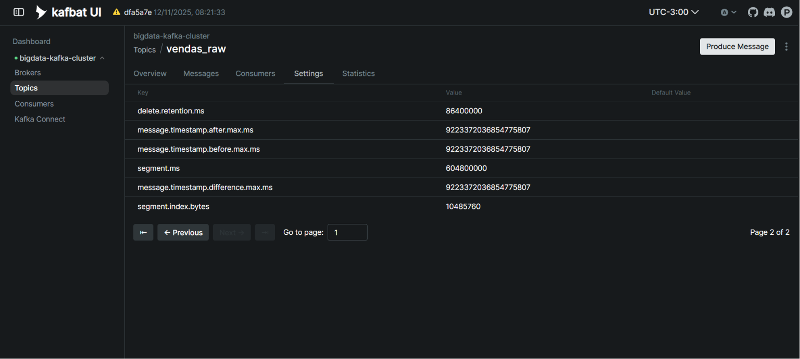
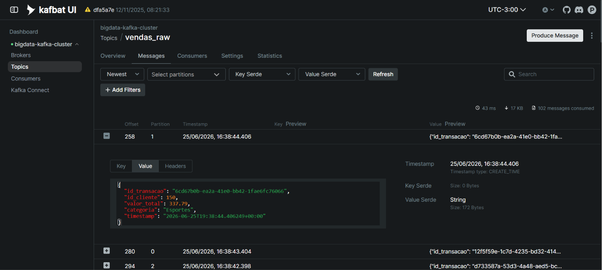
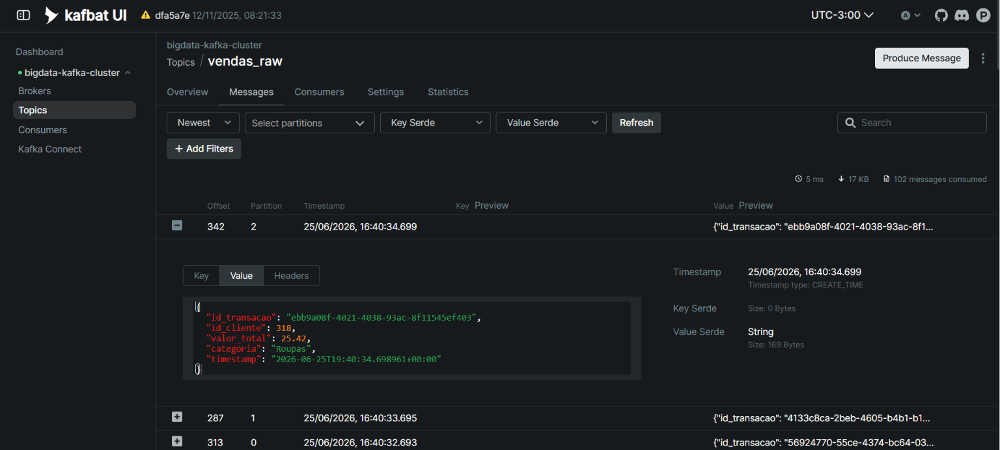
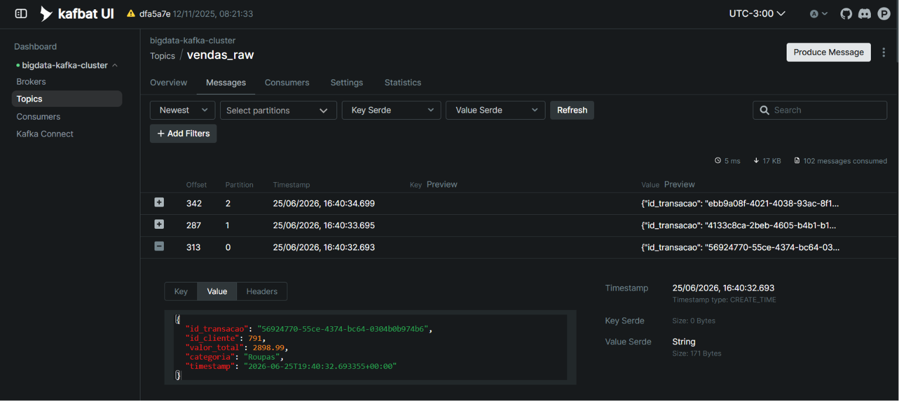

# Etapa 1 - Produtor Kafka

Esta pasta contém as evidências da implementação da **Etapa 1**, responsável pela geração contínua de dados sintéticos e envio para o tópico Kafka `vendas_raw`.

## Objetivo

Implementar um produtor em Python capaz de:

* Gerar transações sintéticas continuamente;
* Publicar mensagens no tópico Kafka `vendas_raw`;
* Simular transações de diferentes categorias;
* Gerar ocasionalmente transações de alto valor para testes das próximas etapas do projeto;
* Validar o funcionamento através do KafBat UI.

---

# Evidências

## P1 - Logs do Produtor

Retorno do comando:

```bash
docker logs -f producer
```

Mostra o produtor em execução enviando transações continuamente para o Kafka.



---

## P2 - Overview do tópico vendas_raw

Visão geral do tópico criado no Kafka.

Permite validar a existência do tópico utilizado pelo produtor.



---

## P3 - Configurações do tópico vendas_raw (Parte 1)

Configurações e propriedades do tópico Kafka.



---

## P4 - Configurações do tópico vendas_raw (Parte 2)

Continuação das configurações do tópico.



---

## P5 - Configurações do tópico vendas_raw (Parte 3)

Demais configurações associadas ao tópico.



---

## P6 - Mensagens recebidas pelo Kafka (Parte 1)

Visualização das mensagens armazenadas no tópico `vendas_raw`, com os campos JSON expandidos.

Campos gerados:

* id_transacao
* id_cliente
* valor_total
* categoria
* timestamp



---

## P7 - Mensagens recebidas pelo Kafka (Parte 2)

Continuação da visualização das mensagens recebidas pelo Kafka.



---

## P8 - Mensagens recebidas pelo Kafka (Transação de Alto Valor)

Exemplo de transação contendo valor elevado, utilizada para testes das próximas etapas do projeto.

Essa evidência demonstra que o produtor gera eventos capazes de acionar futuras regras de negócio implementadas no Flink.



---

# Estrutura Utilizada

```text
producer/
├── producer.py
├── requirements.txt
└── Dockerfile
```

Tópico Kafka utilizado:

```text
vendas_raw
```

Formato das mensagens:

```json
{
  "id_transacao": "uuid",
  "id_cliente": 123,
  "valor_total": 350.50,
  "categoria": "Livros",
  "timestamp": "2026-06-25T20:00:00Z"
}
```
